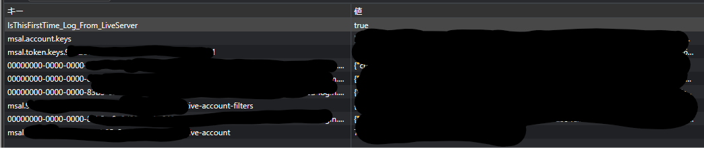
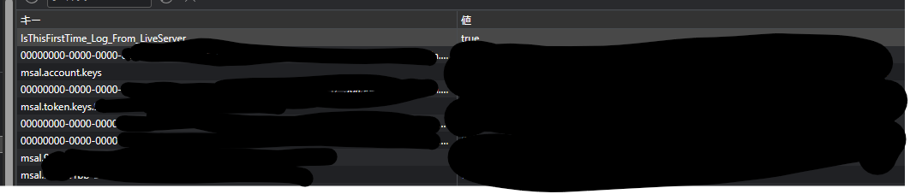
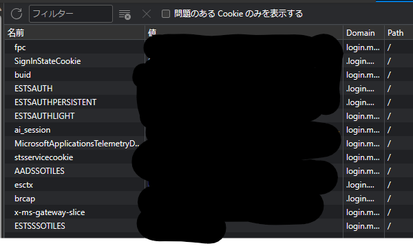
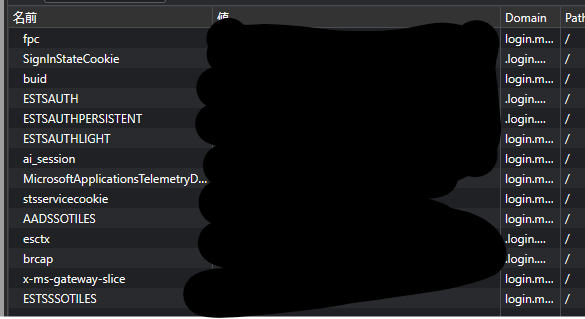

WAM(Web Account Manager) Brokerの動作を確認したコードとなります。

[msal.jsの3.0から `allowNativeBroker`オプションがデフォルトtrueになるよう](https://github.com/AzureAD/microsoft-authentication-library-for-js/releases/tag/msal-browser-v3.0.0-alpha.0)なので動きの確認をしたい。というのが目的です。

# 注意

この記事は2023年07月時点の記事となります。

参照時期によっては記載しているコマンド、コードが動作しない可能性がありますので、その点ご留意ください。

こちらのコードでは下記のバージョンのライブラリを使用しています。

`@azure/msal-browser`: 2.38.0

# 公式サンプルのある場所

[wamBroker](https://github.com/AzureAD/microsoft-authentication-library-for-js/tree/396f5b2ff4bfbd56a991e2b0b706c90e5f98fdec/samples/msal-browser-samples/VanillaJSTestApp2.0/app/wamBroker)

# msal.jsのWAM(Web Account Manager)対応

WindwosのNativeアプリケーションのSSOなんかで利用されていたWeb Account Manager(WAM)がmsal.jsから利用できるようになっています。これ自体は結構前から実装されているものです。

UWPなどのアプリケーションではMSのアクセストークンを取得する処理のADALの後継として活躍していたのこと。

* 参考: [Web アカウント マネージャー](https://learn.microsoft.com/ja-jp/windows/uwp/security/web-account-manager)

# 実装の流れ

## 設定

設定の`system`に`allowNativeBroker`プロパティがあるのでそれを`true`に設定します。
（現在はfalseが既定値っぽいですが、3.0からはtrueになる流れみたいですね）

## Clientのイニシャライズ

msal.jsを普通に使う場合はイニシャライズ処理は必要ありませんが、WAMを利用する場合必要となります。

* 参考: [PublicClientApplication.ts](https://github.com/AzureAD/microsoft-authentication-library-for-js/blob/396f5b2ff4bfbd56a991e2b0b706c90e5f98fdec/lib/msal-browser/src/app/PublicClientApplication.ts#L81C15-L81C15)

イニシャライズ処理が終了した後はいつも通り`handleRedirectPromise`処理を実行します。

```typescript
// client -> PublicClientApplication
this.client.initialize().then(() => {
    this.client.handleRedirectPromise().then(this.handleresponse);
});
// or
await this.client.initialize()
const res = await this.client.handleRedirectPromise();
```

サンプルの実装は[auth.ts](./scripts/auth.ts)にあります。

## アクセストークンの取得

あとは基本的なmsal.jsの使い方と同じでOKみたいです。

```typescript
// client -> PublicClientApplication
// account -> AccountInfo
const res = await this.client.acquireTokenSilent({ account: this.account, scopes: [ 'user.read' ] });
```

# 動作として何が変わったのか

ただ、拡張機能の[Windwos Accounts](https://chrome.google.com/webstore/detail/windows-accounts/ppnbnpeolgkicgegkbkbjmhlideopiji?hl=ja)の有無で多少振る舞いが変わるようです。

が、普通の使い方を行ったときと何が変わるのかというと振る舞いはあまり変わりませんでした。Session StorageやCookieの構成が大きく変わったってこともなさそうですし。

* allowNativeBroker:trueのSession Storage


* allowNativeBroker:falseのSession Storage


* allowNativeBroker:trueのCookie


* allowNativeBroker:falseのCookie


トレースログを見ている感じNativeBroker側の処理は利用されているっぽいのですが、具体的な効果を確認するにはIntuneとかの導入が必要なのかもしれませんね。

